# 📦 Sistem Monitoring Distribusi Barang Menggunakan QR Code dan Metode Simple Additive Weighting (SAW)


## 📖 Tentang Proyek

Sistem Monitoring Distribusi Barang merupakan aplikasi berbasis web yang dirancang untuk membantu proses monitoring distribusi barang secara **real-time** menggunakan **QR Code** serta mendukung pengambilan keputusan prioritas distribusi menggunakan metode **Simple Additive Weighting (SAW)**.

Sistem ini dikembangkan sebagai **Proyek Tugas Akhir** dengan tujuan meningkatkan efisiensi proses distribusi barang melalui digitalisasi pencatatan status barang dan pemberian rekomendasi prioritas distribusi.

---

## 🎯 Tujuan Proyek

Proyek ini bertujuan untuk:

- Mempermudah proses monitoring distribusi barang.
- Mengurangi kesalahan pencatatan distribusi secara manual.
- Memanfaatkan QR Code sebagai identitas unik setiap barang.
- Memberikan rekomendasi prioritas distribusi menggunakan metode SAW.
- Menampilkan dashboard monitoring distribusi secara interaktif.

---

# ✨ Fitur Utama

## 🔐 Autentikasi Multi Role

- Login Admin
- Login Kurir
- Hak akses berdasarkan role

---

## 📦 Manajemen Barang

- Tambah barang
- Edit barang
- Hapus barang
- Detail barang
- Upload gambar QR
- Generate QR Code otomatis

---

## 📥 Import Dataset Kaggle

- Upload dataset CSV
- Preview data sebelum import
- Import ribuan data sekaligus
- Menghindari data duplikat
- QR Code dibuat otomatis
- Riwayat tracking dibuat otomatis
- Nilai SAW dihitung otomatis

---

## 📱 QR Code Tracking

- Generate QR Code
- Scan QR Code
- Update status barang
- Tracking lokasi distribusi

---

## 🚚 Monitoring Distribusi

Status distribusi meliputi:

- Barang Diproses
- Barang Dikirim
- Barang Sampai Gudang
- Barang Diterima

Seluruh perubahan status akan otomatis tersimpan pada riwayat distribusi.

---

## 📊 Dashboard Monitoring

Dashboard menyediakan informasi berupa:

- Total Barang
- Total Kurir
- Barang Diproses
- Barang Dikirim
- Barang Diterima
- Grafik Status Distribusi
- Grafik Kategori Barang
- Aktivitas Distribusi Terbaru
- Barang Prioritas Tertinggi
- Top 10 Prioritas Distribusi

---

## 🧮 Perhitungan Metode SAW

Implementasi metode **Simple Additive Weighting (SAW)** menggunakan kriteria:

| Kriteria              | Bobot |
| --------------------- | ----- |
| Urgensi               | 40%   |
| Lama Penyimpanan      | 35%   |
| Tingkat Keterlambatan | 25%   |

Fitur SAW meliputi:

- Normalisasi data
- Perhitungan nilai preferensi
- Ranking prioritas distribusi
- Grafik Ranking SAW
- Grafik Distribusi Prioritas
- Interpretasi hasil
- Export PDF hasil SAW

---

## 📄 Laporan

- Export PDF QR Code
- Export PDF Perhitungan SAW
- Laporan Distribusi Barang

---

# 🛠 Tech Stack

## Backend

- Laravel 12
- PHP 8.2
- MySQL

## Frontend

- Blade Template
- Bootstrap 5
- Bootstrap Icons
- Chart.js

## Library

- Simple QrCode
- DomPDF

## Tools

- Laragon
- Visual Studio Code
- Git
- GitHub

---

# 📂 Struktur Folder

```
app/
bootstrap/
config/
database/
public/
resources/
routes/
storage/
```

---

# 🚀 Cara Menjalankan Proyek

## 1 Clone Repository

```bash
git clone https://github.com/USERNAME/NAMA-REPOSITORY.git
```

---

## 2 Masuk ke Folder

```bash
cd NAMA-REPOSITORY
```

---

## 3 Install Dependency

```bash
composer install
```

---

## 4 Copy Environment

```bash
cp .env.example .env
```

---

## 5 Generate Application Key

```bash
php artisan key:generate
```

---

## 6 Konfigurasi Database

Buat database MySQL kemudian sesuaikan konfigurasi pada file **.env**

```env
DB_DATABASE=nama_database
DB_USERNAME=root
DB_PASSWORD=
```

---

## 7 Jalankan Migration

```bash
php artisan migrate
```

---

## 8 Jalankan Seeder (Opsional)

```bash
php artisan db:seed
```

---

## 9 Jalankan Server

```bash
php artisan serve
```

Buka browser

```
http://127.0.0.1:8000
```

---

# 📷 Screenshot Aplikasi

## 🔐 Login

<p align="center">
    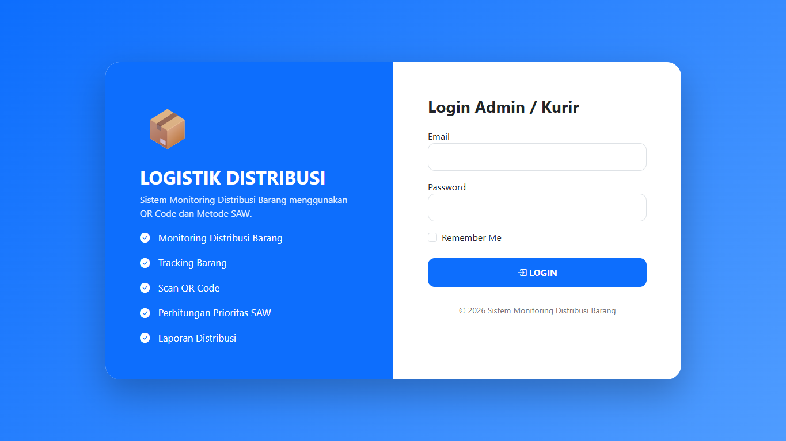
</p>

---

## 📊 Dashboard

<p align="center">
    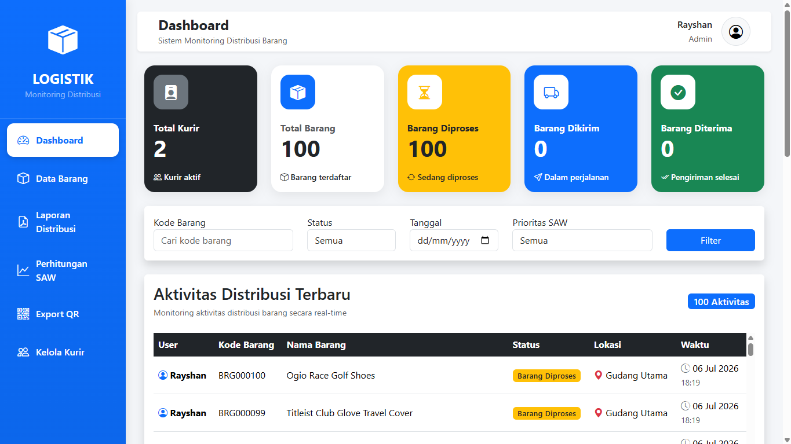
</p>

<p align="center">
    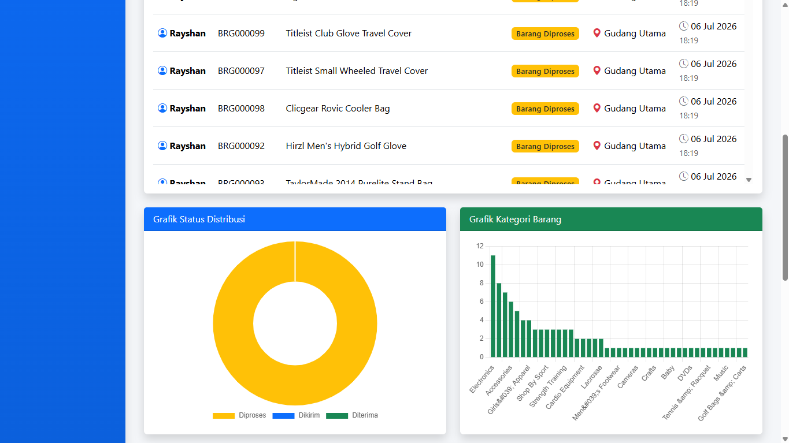
</p>

<p align="center">
    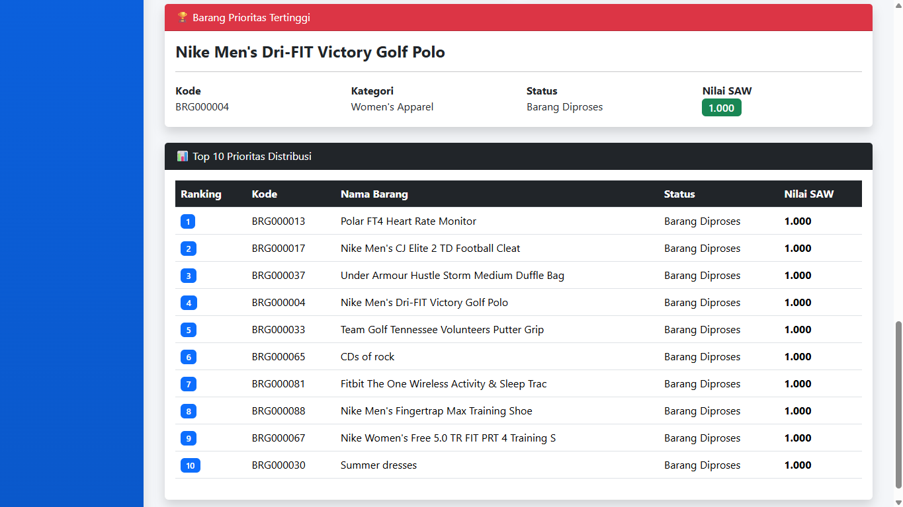
</p>

---

## 📦 Data Barang

<p align="center">
    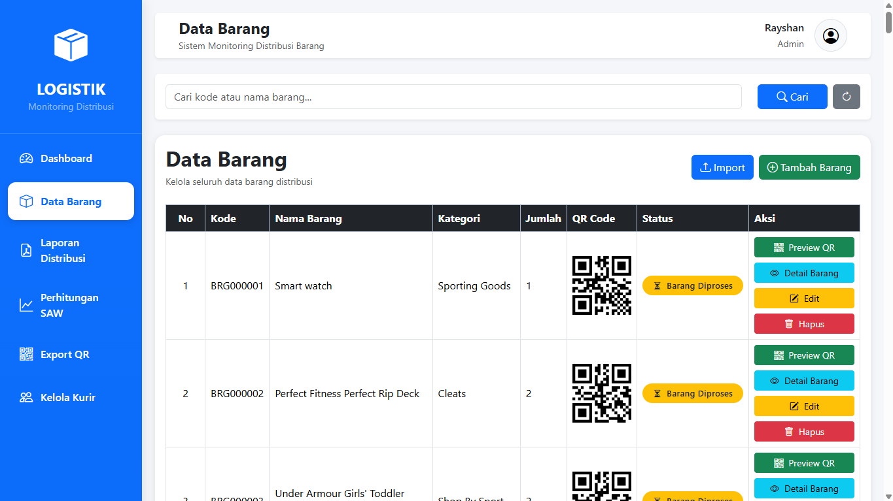
</p>

---

## 📄 Detail Barang

<p align="center">
    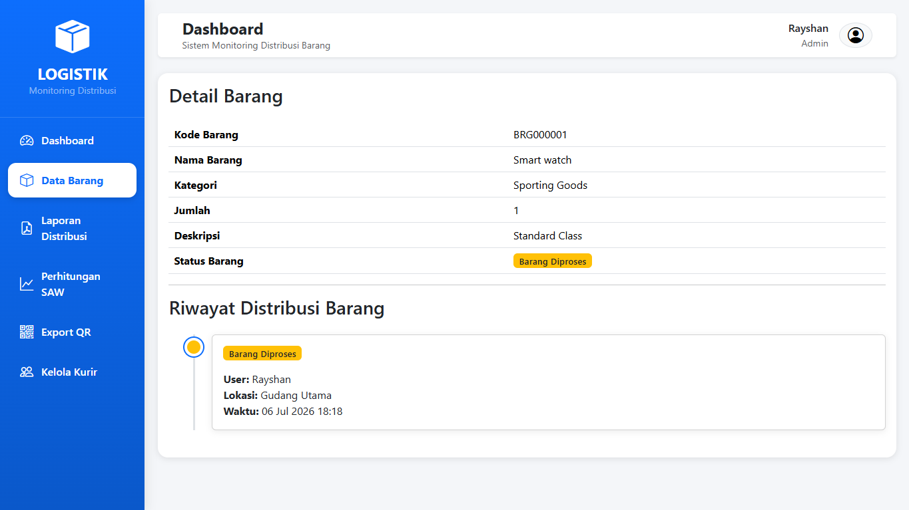
</p>

---

## 📈 Dashboard SAW

<p align="center">
    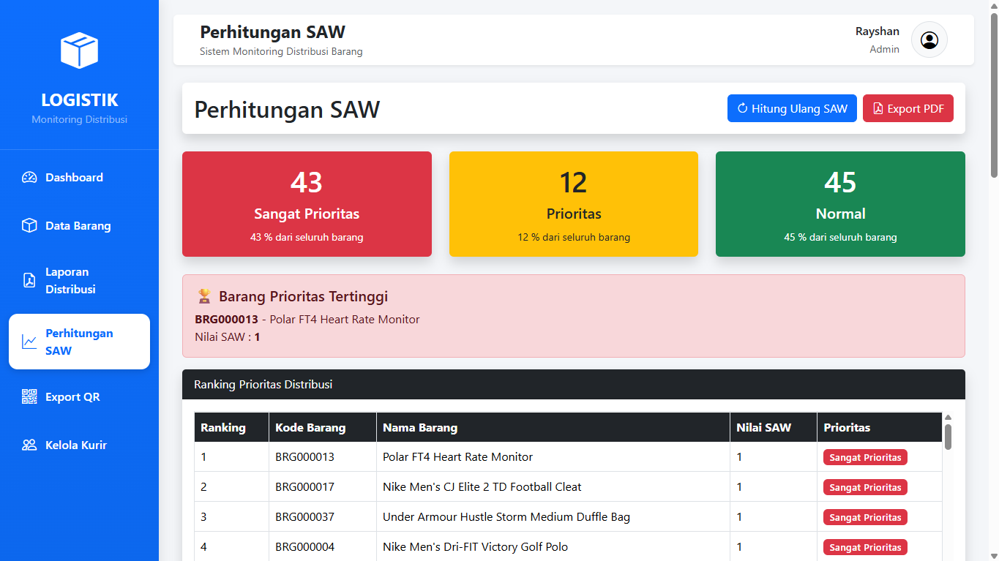
</p>

<p align="center">
    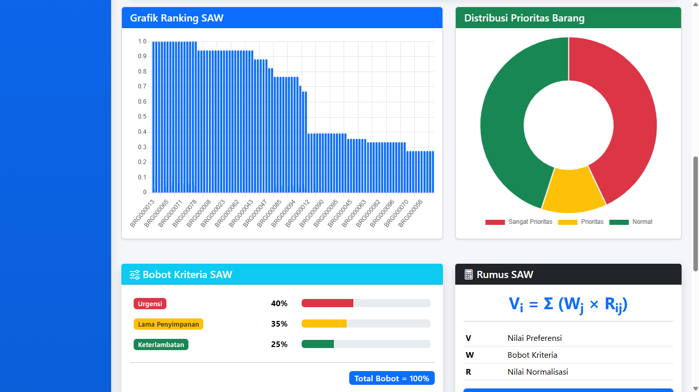
</p>

<p align="center">
    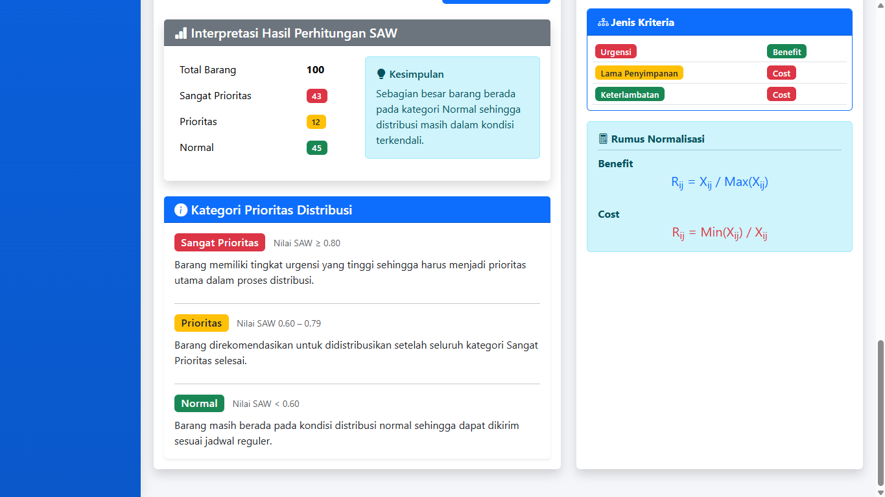
</p>

---

## 📷 Scan QR

<p align="center">
    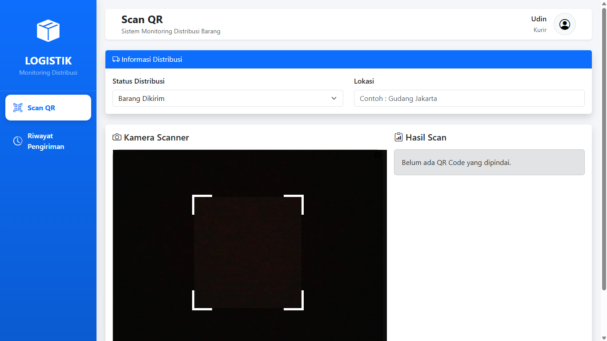
</p>

---

## 🚚 Riwayat Distribusi

<p align="center">
    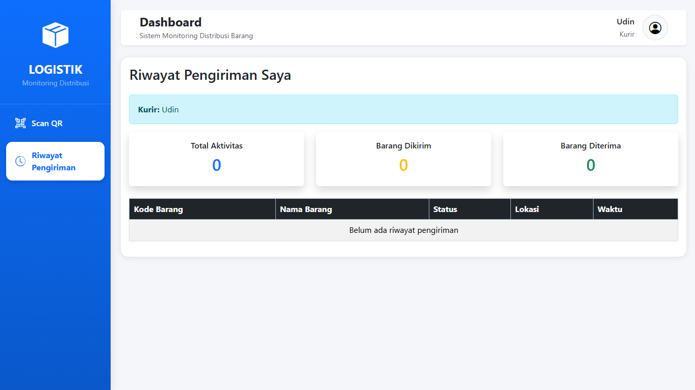
</p>

---

# 📈 Metode SAW

Metode SAW digunakan untuk menentukan prioritas distribusi berdasarkan tiga kriteria.

### Rumus Preferensi

```
Vi = Σ (Wj × Rij)
```

Keterangan:

- **V** = Nilai Preferensi
- **W** = Bobot
- **R** = Nilai Normalisasi

---

# 💡 Tantangan Selama Pengembangan

Beberapa tantangan yang dihadapi selama proses pengembangan antara lain:

### 1. Integrasi Dataset Kaggle

Dataset memiliki ribuan data dengan struktur yang berbeda dari database aplikasi sehingga diperlukan proses pemetaan kolom, validasi data, serta pencegahan data duplikat sebelum proses import.

---

### 2. Otomatisasi QR Code

Setiap barang hasil import harus memiliki QR Code yang dibuat secara otomatis tanpa proses manual, sehingga dilakukan integrasi dengan library Simple QrCode.

---

### 3. Riwayat Distribusi Otomatis

Barang hasil import tidak hanya disimpan ke database, tetapi juga harus otomatis membuat riwayat distribusi pertama agar seluruh aktivitas dapat dimonitor sejak awal.

---

### 4. Implementasi Metode SAW

Menentukan bobot kriteria, melakukan normalisasi data, menghitung nilai preferensi, hingga menghasilkan ranking prioritas distribusi membutuhkan validasi agar hasil sesuai dengan teori metode SAW.

---

### 5. Dashboard Interaktif

Menyajikan data distribusi dalam bentuk KPI, grafik, ranking, dan interpretasi hasil membutuhkan integrasi antara Laravel, Chart.js, dan Bootstrap agar informasi mudah dipahami oleh pengguna.

---

### 6. Responsive Design

Seluruh halaman dirancang agar tetap nyaman digunakan pada desktop, tablet, maupun perangkat mobile dengan memanfaatkan Bootstrap Grid System dan komponen Offcanvas.

---

# 📌 Pengembangan Selanjutnya

Beberapa pengembangan yang dapat dilakukan di masa mendatang:

- Notifikasi distribusi secara real-time
- Integrasi Google Maps
- Scan QR menggunakan perangkat mobile
- Dashboard analitik yang lebih lengkap
- Integrasi REST API
- Prediksi distribusi menggunakan Machine Learning

---

# 👨‍💻 Author

**Rayshan Gani Putra**

Sistem Monitoring Distribusi Barang Menggunakan QR Code dan Metode Simple Additive Weighting (SAW)

Universitas Logistik dan Bisnis Internasional Bandung

2026

---

⭐ Apabila proyek ini bermanfaat, jangan lupa berikan **Star** pada repository ini.
